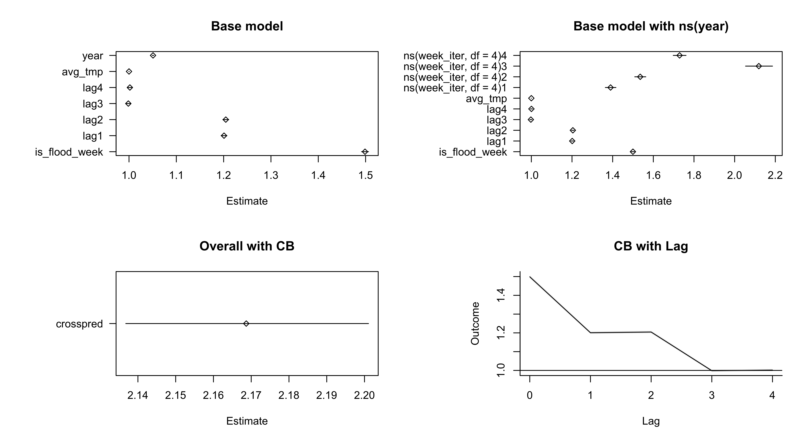

# ACRES_flood
Flood exposure code for ACRES

run testing scenarios from `04_run.R`

For example, for a county with the following params:

```
RR_1     <- 1.50  # the RR on lag 0
RR_1_lag <- 1.20  # the RR on lags 1:4
ybeta_1  <- 1.05  # the year trend (in log space, so 2 means doubling every year)
```
you get:



## ToDo:

* need to confirm that the lag, and year effect is working correctly
* confirm that meta regression works